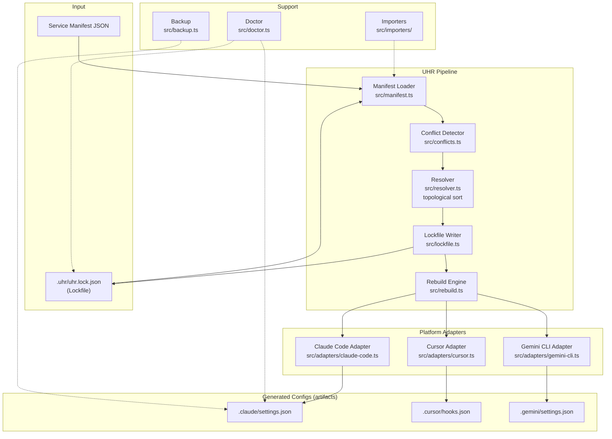
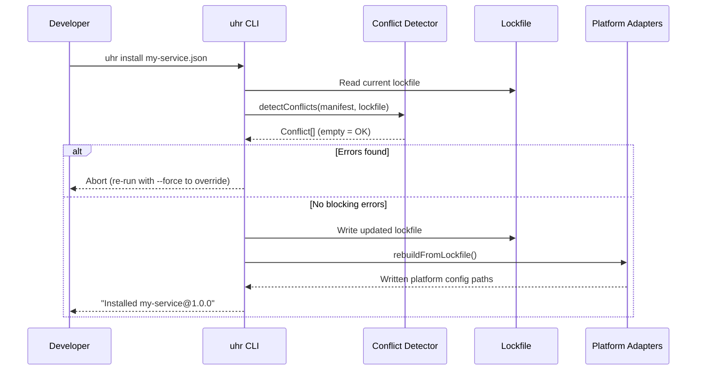

# Architecture: UHR — Universal Hook Registry

<!-- Generated: 2026-03-02 | Source: src/types.ts, src/cli.ts, src/conflicts.ts, package.json -->

> npm-style dependency resolution for AI coding CLI hooks. Services declare hook requirements in a manifest; UHR merges declarations, detects conflicts, and generates platform-native configs as build artifacts.

## System Overview

UHR is a **build-time-only** CLI tool. It reads service manifests, resolves ordering with a topological sort, detects conflicts, writes a deterministic lockfile, and outputs platform-native config files. There is zero runtime overhead — the generated files are static artifacts consumed directly by AI coding tools (Claude Code, Cursor, Gemini CLI).

## Component Diagram



## Data Flow



## Services

### CLI Entry (`bin/uhr.ts` → `src/cli.ts`)
- **Runtime**: Bun
- **Role**: Parses argv, dispatches commands, orchestrates the pipeline
- **Commands**: `init`, `install`, `uninstall`, `update`, `list`, `check`, `diff`, `rebuild`, `doctor`, `restore`, `import`, `migrate`
- **Flags**: `--platforms`, `--force`, `--dry-run`, `--yes`, `--mode`, `--json`

### Resolver (`src/resolver.ts`)
- **Role**: Topological sort of service `ordering` constraints (runAfter/runBefore)
- **Output**: `resolvedOrder` map written to lockfile

### Conflict Detector (`src/conflicts.ts`)
- **Role**: Checks incoming manifest against all installed services
- **Conflict types**: explicit, missing_requirement, permission_contradiction, duplicate_hook, shared_slot, circular_ordering, platform_gap, ownership_collision
- **Severities**: error (blocks install), warning (reported but allows install with `--force`), info

### Lockfile (`src/lockfile.ts`)
- **Path**: `.uhr/uhr.lock.json`
- **Version**: v2 (auto-upgrades from v1)
- **Contents**: Platform list, merge mode, installed services, resolved hook order, generation timestamp

### Platform Adapters (`src/adapters/`)
- **claude-code**: Writes `.claude/settings.json` — hooks array, permission allow/deny lists
- **cursor**: Writes `.cursor/hooks.json` — Cursor-native hook format
- **gemini-cli**: Writes `.gemini/settings.json` — Gemini CLI hook format
- All adapters mark generated files with `_managedBy: "uhr"` and `_generatedAt` for staleness detection

### Doctor (`src/doctor.ts`)
- **Role**: Diagnoses installation health
- **Checks**: Missing configs, stale timestamps, orphaned UHR configs, manifest integrity, zero-effective-hooks services, backup index staleness, import drift

### Importers (`src/importers/`)
- **Role**: Reads existing platform configs and maps them to UHR hook format
- **Used by**: `uhr import` (read-only inspection) and `uhr migrate` (import + register)

### Backup (`src/backup.ts`)
- **Role**: Snapshots platform configs before destructive operations
- **Storage**: `.uhr/backups/<timestamp>/`

## Core Types

```typescript
// The three supported AI coding platforms
type PlatformId = "claude-code" | "cursor" | "gemini-cli";

// How conflicting hooks are resolved during rebuild
type MergeMode = "strict" | "preserve" | "hybrid";

// Who "owns" a hook in the lockfile
type HookOwnership = "uhr-managed" | "imported" | "external";

// A single hook declaration in a service manifest
interface HookDeclaration {
  id: string;
  on: UniversalEvent;       // When this fires
  command: string;          // Shell command
  tools?: string[];         // Tool filter (omit = all tools)
  blocking?: boolean;
  timeout?: number;
  background?: boolean;
  platforms?: PlatformId[]; // Platform filter (omit = all platforms)
}

// The lockfile (source of truth)
interface UhrLockfile {
  lockfileVersion: 2;
  generatedAt: string;
  platforms: PlatformId[];  // Active platforms — never mutated by ephemeral flags
  installed: Record<string, InstalledService>;
  resolvedOrder: Record<string, string[]>;
  mergeMode: MergeMode;
}
```

## Key Design Principles

| Principle | Implementation |
|-----------|---------------|
| **Zero runtime overhead** | Build-time only — produces static config files consumed by platforms |
| **Append, don't replace** | Installing a service adds hooks alongside existing ones |
| **Explicit over implicit** | Conflicts detected before installation, not at runtime |
| **Platform-honest** | Adapters translate honestly or decline; never produce broken mappings |
| **Lockfile is source of truth** | Platform configs are always regenerated from lockfile; hand-edits are overwritten |
| **Ephemeral flags** | `--platforms` on `rebuild`/`install` is a filter, not a persistent mutation |

## Directory Layout

```
uhr/
├── bin/
│   └── uhr.ts                  # CLI entry point
├── src/
│   ├── cli.ts                  # Command handlers
│   ├── resolver.ts             # Topological sort
│   ├── conflicts.ts            # Conflict detection
│   ├── lockfile.ts             # Lockfile read/write/upgrade
│   ├── manifest.ts             # Manifest loading + validation
│   ├── rebuild.ts              # Platform config regeneration
│   ├── doctor.ts               # Health diagnostics
│   ├── backup.ts               # Backup/restore
│   ├── service-diff.ts         # Diff computation
│   ├── service-state.ts        # Dependency graph queries
│   ├── ordering.ts             # Ordering constraint helpers
│   ├── types.ts                # Shared TypeScript types
│   ├── adapters/
│   │   ├── claude-code.ts
│   │   ├── cursor.ts
│   │   └── gemini-cli.ts
│   ├── importers/              # Platform config → UHR hook importers
│   └── util/
│       ├── patterns.ts         # hooksForPlatforms(), permissionPatternsOverlap(), toolsOverlap()
│       └── integrity.ts        # SHA hash for manifest integrity
├── schema/
│   ├── manifest.v1.json        # JSON schema for service manifests
│   └── lockfile.v2.json        # JSON schema for lockfile
├── test/                       # Mirror of src/ structure
└── UHR_SPEC.md                 # Authoritative technical specification
```

## Tech Stack

| Layer | Technology |
|-------|-----------|
| Runtime | Bun (not Node.js) |
| Language | TypeScript (strict mode) |
| Distribution | npm package (`uhr`) |
| CLI framework | Minimal — `Bun.argv` + custom parser (no heavy deps) |
| Testing | `bun test` |
| Config format | JSON (manifests, lockfile, generated configs) |
| Linting | Biome |
